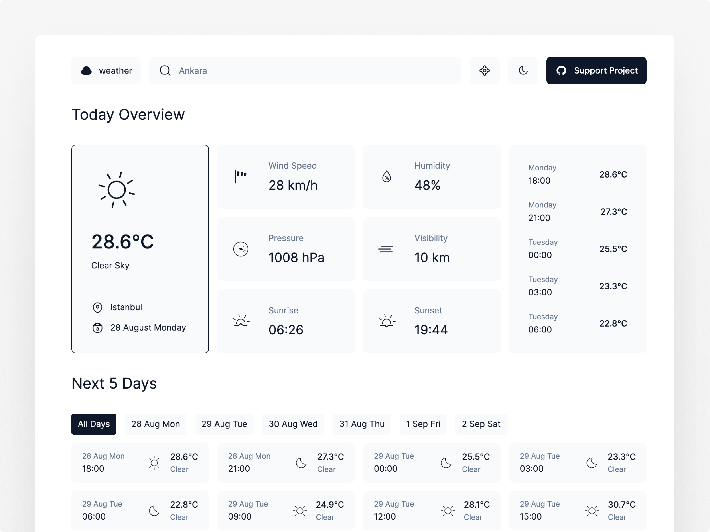

# Weather

## Installation

Clone the repository and install dependencies using npm:

`npm install`

## Usage

Start the development server:

`npm run dev`

This will open the app in your default browser.

## Contributing

If you find any issues or have suggestions for improvement, please open an issue or submit a pull request on GitHub.

